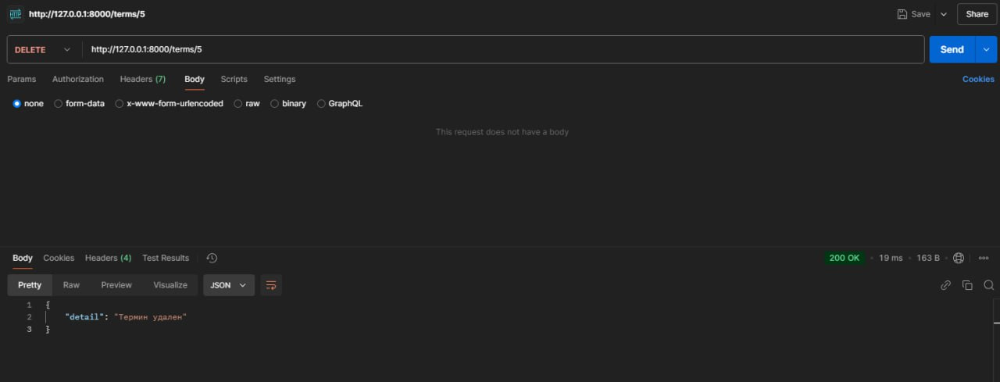

# Лабораторная работа №7. REST. FastAPI. Swagger

## Запуск проекта 

```bash
docker-compose up
```


## Демонстрация

### Swagger


### Получение списка всех терминов.

```
GET 'http://localhost:8000/terms/'
```


### Получение информации о конкретном термине по ключевому слову.


```
GET "http://127.0.0.1:8000/terms/search/?keyword=Redux"
```


### Получение термина по id

```
GET "http://127.0.0.1:8000/terms/1"
```


### Добавление нового термина с описанием.
```
POST "http://127.0.0.1:8000/terms/"
```


### Обновление существующего термина.

```
PUT "http://127.0.0.1:8000/terms/5"
```


### Удаление термина из глоссария.

``` 
DELETE "http://127.0.0.1:8000/terms/5"
```


